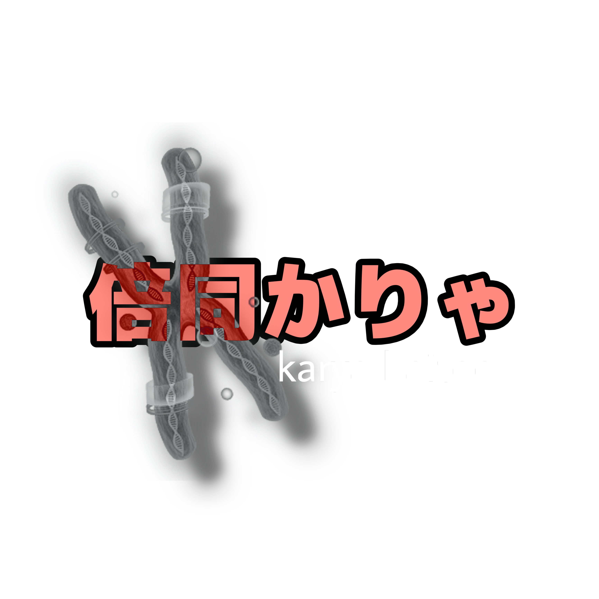

## Character Bio

- **Age:** Ageless (fake age 17)  
- **Gender:** Male  
- **Orientation:** Aroace
- **Personality/Traits:**Person made in a lab from asexual reproduction.

## Appearance

- **Eyes:** Blue  
- **Skin:** Pale 
- **Hair:** Red
- **Clothing/Accessories:**  
  - Necklace
  - Gray sweatpants  
  - Black turtleneck
  - Black Converse shoes  

## Notes
He uses the reclist from felinewasteland.

Karya was made in an Armenian lab on accident while scientists were experimenting on a test subject by modifying a human using planarian genes to test limb regeneration, but one of genes were copied twice, so when they removed the limb, it ended up turning into Karya. They tested him and microchipped him but let him go because he had inherited the regeneration powers meaning he could asexually reproduce. Karya has escaped the lab since.

His favorite food is orange chicken or anything spicy, but not too acidic.

His favorite drink is kiwi juice or frappes.

## Technical Details

- **Voice Type:** Romaji 単独音 (CV) 
- **Recommended Editor:** UTAlet, OpenUtau  
- **Recommended Phonemizer:** the default one 
- **Recommended Resampler:** MoReSampler

## Demo

<iframe width="560" height="315" src="https://www.youtube-nocookie.com/embed/Pt_8OWwdH2g?si=YIXmb5efWa1SsLCF" title="YouTube video player" frameborder="0" allow="accelerometer; autoplay; clipboard-write; encrypted-media; gyroscope; picture-in-picture; web-share" referrerpolicy="strict-origin-when-cross-origin" allowfullscreen></iframe>

## Usage Rules:
1. Personal Use: You may freely use this voicebank for songs, demos, and illustrations.
2. Commercial Use: Contact the creator first before using in commercial projects.
3. Redistribution: Do not redistribute the voicebank as your own. Linking to the official download is allowed.
4. Credit: Always credit the following when using Baitoo Karya:
   - Base TTS Program: Microsoft Mike (SAPI5, Microsoft, 1997)
   - UTAU Voicebank Creator: duro@ZuP
   - Character Design: duro@ZuP
5. Content Restrictions:
   - Do NOT depict Karya in extreme NSFW situations.
   - Do NOT use Karya in works involving sexualization of minors.
   - Do NOT depict Karya committing acts of hate speech, glorified violence, or discriminatory actions.
   - You MAY depict Karya in regular, general-audience songs, illustrations, comics, animations, or stories.
6. Modifications: You may modify the audio or use derivatives, but always credit the original creator and Microsoft for the base voice.

##  Legal Note:
The Microsoft Sam, Mike, and Mary voices have been used for many things over the years, including:
  - Narration on commercial presentations
  - Monetized YouTube videos
  - Online, free-to-use text-to-speech websites
and more. Microsoft has never required royalties for these voices. You do not need to ask Microsoft for permission to use them.

SAPI 4.0, which Sam, Mike, and Mary used, was released in 1998 and is no longer supported on modern Windows systems. After Microsoft stopped using these voices, CFS-Technologies (the company that controlled them) shut down in 2012. These voices remain free to download and use.

## Copyright Disclaimer:
Under Section 107 of the Copyright Act 1976, allowance is made for "fair use" for purposes such as criticism, comment, news reporting, teaching, scholarship, and research. Non-profit, educational, or personal use favors fair use.
